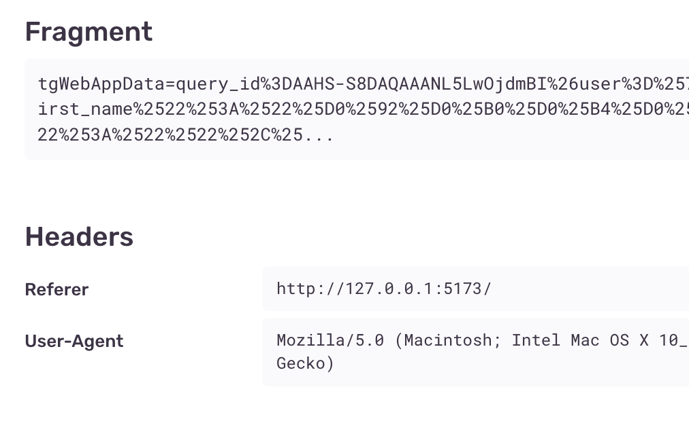
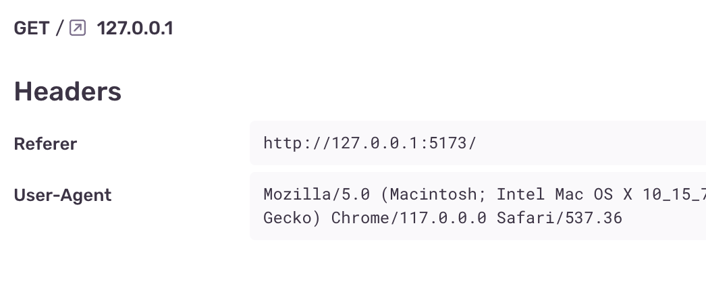
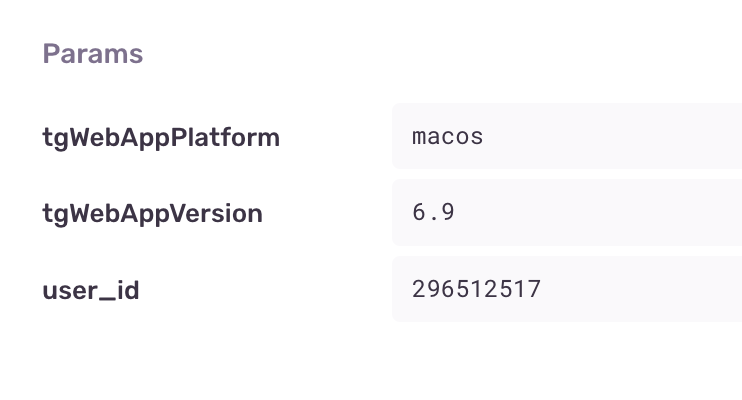
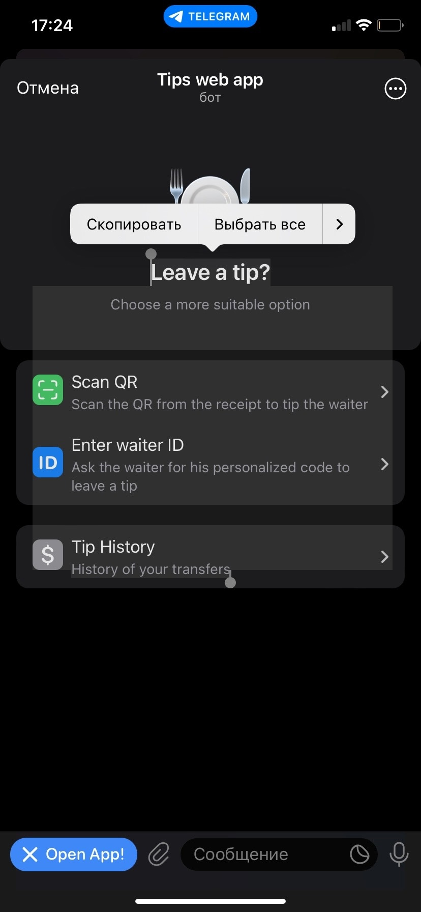

## Tips — Telegram Mini App Example
Demo: [t.me/tips_web_app_bot](https://t.me/tips_web_app_bot)


## Features
:white_check_mark: Разработанный с нуля простой UI kit с имплементацией методов [@tma.js/sdk](https://feature-sliced.design)<br>
:white_check_mark: Интеграция с Telegram платежами<br>
:white_check_mark: Поддержка нескольких точек входа: Main Bot Button, Inline Button, Direct Link, Direct Link с хендлером startapp параметра<br>
:white_check_mark: Проработанный developer experience: eruda для дебага в режиме development, Sentry в режиме production. Sentry настроена так, чтобы сенситив данные (например, хеш пользователя) не логгировались<br>
____
## Оглавление
1. [Клиентская часть](#Клиентская_часть)
   1. [Стек и фичи](#Клиентская_часть_стек)
   2. [Архитектура проекта](#Клиентская_часть_архитектура)
   3. [UI kit](#Клиентская_часть_uikit)
   4. [Установка и сборка](#Клиентская_часть_установка_и_сборка)
2. [Серверная часть](#Серверная_часть)
   1. [Стек и фичи](#Серверная_часть_стек)
   2. [Установка и сборка](#Серверная_часть_архитектура)
3. [Полезные советы для разработчиков Telegram Mini Apps](#Советы)
4. [Полезные ресурсы](#Ресурсы)
5. [Лицензия](#Лицензия)
____
## Клиентская часть
### Стек и фичи
- React + Typescript + SCSS Modules
- Vite
- Feature-sliced design в качестве архитектуры проекта
- Axios + @tanstack/react-query
- React-router-dom
- Разработанный с нуля простой UI kit с имплементацией методов @tma.js/sdk
- Eruda для дебага в режиме development, Sentry в режиме production
### Архитектура проекта


Проект построен на основе архитектурной методологии **Feature-Sliced design (FSD)**. 
В рамках этой методологии, проект состоит 6 слайсов:
1. **app** — настройки, стили и провайдеры для всего приложения
2. **pages** (страницы) — композиционный слой для сборки полноценных страниц из сущностей, фич и виджетов
3. **widgets** (виджеты) — композиционный слой для соединения сущностей и фич в самостоятельные блоки
4. **features** (фичи) — взаимодействия с пользователем, действия, которые несут бизнес-ценность для пользователя
5. **entities** (сущности) — бизнес-сущности приложения (tip, waiter)
6. **shared** — переиспользуемый код, не имеющий отношения к специфике приложения/бизнеса: UI kit, api, libs

Данная методология обеспечивает низкую связанность компонентов приложения и высокую сплоченность, что делает код приложения более структурированным и масштабируемым

[**Документация по Feature-sliced Design**](https://feature-sliced.design/)
### UI kit
Для мини-приложения был разработан собственный UI kit, компоненты которого "из коробки" интегрированы с TMA API (@tma.js/sdk)
#### Фичи
- [**Storybook available**](https://tips-twa-storybook.vercel.app/)
- Поддержка светлой/темной темы
- 13 базовых компонетов: Button, TextField, SegmentedControl, Page etc.
- Компонент Page, который позволяет управлять интерфейсом TMA через пропы:
  - **backgroundColor** - устанавливает фон страницы TMA
  - **headerBackgroundColor** - устаналивает фон шапки TMA
  - **withCloseAppConfirmation** - флаг, нужно ли запрашивать потдерждение при закртии мини-приложения
  - **shouldExpanded** - флаг, должно ли мини-приложение быть раскрытым при открытии страницы
  - **withQuit** - флаг, нужно ли скрывать backButton, чтобы у пользователя была возможность закрыть мини-приложение через нативный крестик в шапке приложения
- Компоненты с поддержкой haptic feedback: Button, Radio, ListItem, SegmentedControl
- @radix-ui/react-slot для полиморфных компонентов

UI kit является **MVP**, был собран в рамках хакатона Telegram Mini App Contest 2023, компоненты могут содержать баги и недочеты

### Установка и сборка
#### Требования:
- node js 16.15.0+
- yarn 1.22.18+
#### Установка:
```yarn install``` - устанавливает зависимости из package.json
#### Environment variables:
Создайте файл `.env` в корне проекта и укажите следующие переменные:

| Variable Name  | Required | Description | Example |
| --- | --- | --- | --- |
| `VITE_API_URL` | **True** | Backend url with prefix /api | `https://my-server.com/api`
| `VITE_SENTRY` | False | Sentry DSN | `https://fw89ew89g7g8ew7g8we8@k3940287.ingest.sentry.io/234234543635523`
#### Запуск проекта:
```yarn dev``` - запускает проект локально, в режиме development
#### Сборка проекта
```yarn build``` - собирает проект в директорию /dist
#### Деплой проекта
После сборки проекта, в корне будет сгенерирована директория /dist с исходным кодом проекта.
Для деплоя можно воспользоваться любым хостингом статики, например, Vercel или Github Pages

## Серверная часть
### Стек и фичи
- Fastify + Typescript
- MSQL + TypeORM
- node-telegram-bot-api as bot core

### Установка и сборка
#### Требования:
- node js 16.15.0+
- yarn 1.22.18+
- MySQL 8.1.0+

#### Установка:
```yarn install``` - устанавливает зависимости из package.json

#### Environment variables:
Создайте файл `.env` в корне проекта и укажите следующие переменные:

| Variable Name  | Required | Description | Example |
| --- | --- | --- | --- |
| `TG_TOKEN` | **True** | Telegram BOT token |
| `TG_PAYMENT_TOKEN` | **True** | Telegram BOT Payment token |
| `TG_BOT_NAME` | **True** | Telegram BOT username (t.me/USERNAME) | tips_web_app_bot
| `TG_BOT_APP_NAME` | **True** | Telegram Mini App name (t.me/username/APP_NAME) | tip
| `TG_BOT_QR_URL` | **True** | Ссылка на изображение, которое бот будет отправлять пользователю при отправке команды /qr |
| `DOMAIN` | **True** | Домен приложения, используется для вебхука | https://my-server.com
| `PORT` | **True** | Порт приложения |
| `DB_HOST` | **True** | Database host |
| `DB_PORT` | **True** | Database port |
| `DB_USER` | **True** | Database user |
| `DB_PASSWORD` | **True** | Database password |
| `DB_DATABASE` | **True** | Database name |

#### Запуск проекта:
```yarn dev``` - запускает проект локально, в режиме development

#### Сборка проекта
```yarn build``` - собирает проект в директорию /dist

#### Запуск проекта
```yarn start``` - запускает билд проекта из директории /dist
____
### Полезные советы для разработчиков Telegram Mini Apps
#### Sentry и секретные данные пользователей
[**Sentry**](https://sentry.io/) позволяет удаленно мониторить баги в фронтенд-приложениях, написанных на JavaScript.
Если ваше фронтенд приложение крашится, Sentry автоматически отправляет информацию об ошибке на удаленный сервер Sentry.

Однако, помимо информации об ошибке, Sentry также может логировать секретные данные пользователя — hash подпись параметров запуска.
Если на бекенде нет проверки auth_date параметра, то зная подпись пользователя, злоумышленник сможет открывать мини-приложение от лица других пользователей.

Чтобы это предотвратить, необходимо фильтровать данные перед логгированием ошибки в Sentry DSN. 
Это можно сделать с помощью метода Sentry.beforeSend. 

Помимо фильтрации данных, вы можете создавать собственный Sentry-контекст, например, в котором будет хранится информация о пользователе, полученная из launch-params.  

| AS IS | TO BE |
| --- | --- |
|  _Sentry сохраняет tgWebAppData, вместе с hash параметром для авторизации на бекенде_ |  _Sentry не сохраняет #hash запроса_ |
| _Изначально отсутствует информация о пользователе в удобним виде_ |  _Отображается только полезная информация о пользователя (из launch params) в удобном виде_ |
[**Пример реализации**](src/shared/lib/sentry/index.ts)
#### Дебаг на мобильных устройствах
В ходе разработки Telegram Mini App может появится необходимость дебага на реальном устростве.
С этим вам может помочь [**Eruda**](https://github.com/liriliri/eruda) — мобильная консоль разработчика
#### Viewport
Добавьте тег viewport для корректного отображения интерфейса на безрамочных смартфонах
```html
<meta
  name="viewport"
  content="width=device-width, initial-scale=1, shrink-to-fit=no, user-scalable=no, viewport-fit=cover"
/>
```
#### User-select


Для улучшения user experience вы можете запретить выделение текста в приложении, оставив возможность выделения только у нужных элементов — input, textarea.
```css
*:not(input):not(textarea),
::after,
::before {
  -moz-user-select: none;
  -webkit-user-select: none;
  -ms-user-select: none;
  user-select: none;
}
```

### Полезные ресурсы
[**Telegram Api**](https://core.telegram.org/api) <br>
[**Bot Payments Api**](https://core.telegram.org/bots/payments) <br>
[**Введение в Telegram Mini Apps**](https://docs.ton.org/develop/dapps/telegram-apps/) <br>
[**Документация @tma-js**](https://docs.telegram-mini-apps.com/docs/introduction/about-platform) <br>


### Лицензия
This project is licensed under the MIT - see the [LICENSE](LICENSE) file for details
